# QtCreator Colors

Color schemes collection for QtCreator!

## Screenshots

### Darcula
<p align="center">
  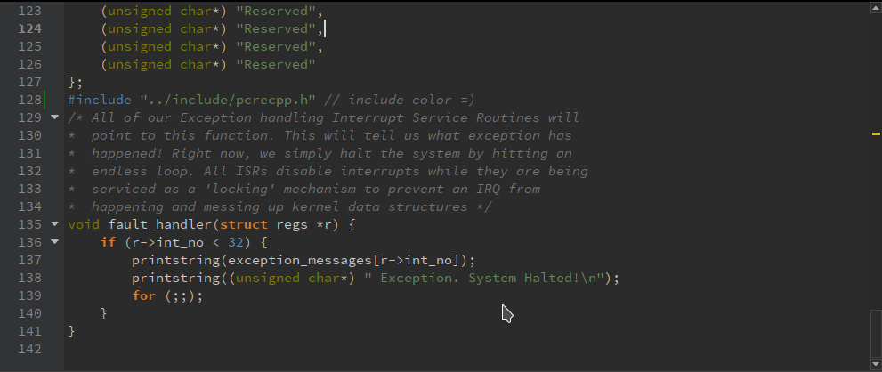
</p>

### DarculaNew
<p align="center">
  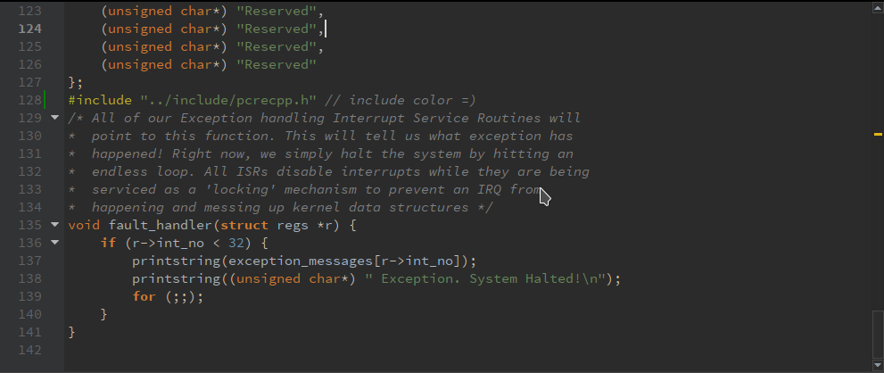
</p>

### Dracula
<p align="center">
  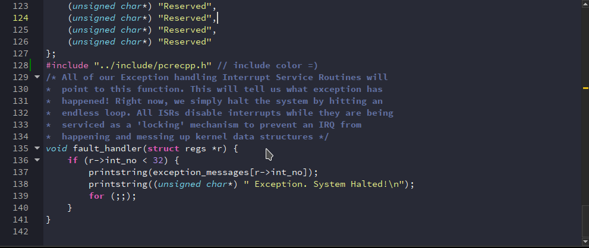
</p>

### IntelliJGreen
<p align="center">
  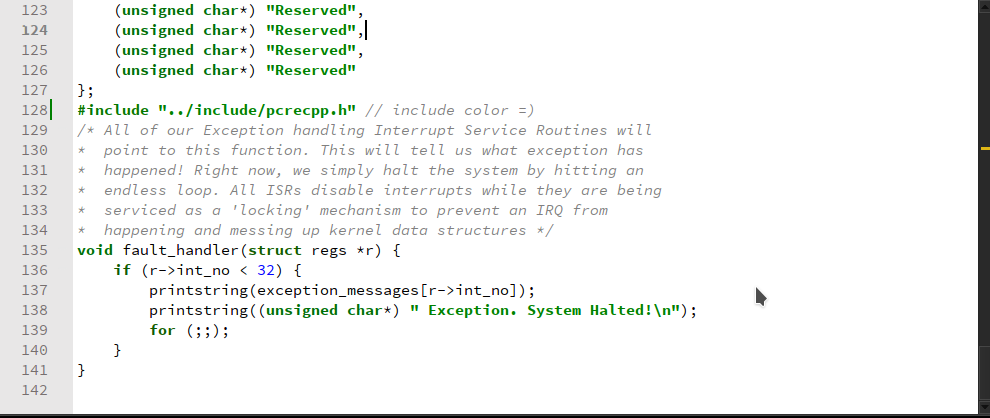
</p>

### Monokai
<p align="center">
  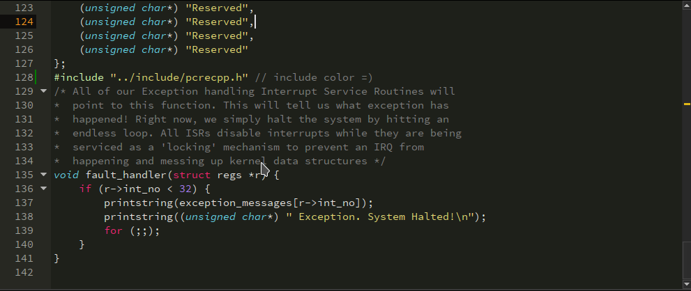
</p>

### SublimeMaterial
<p align="center">
  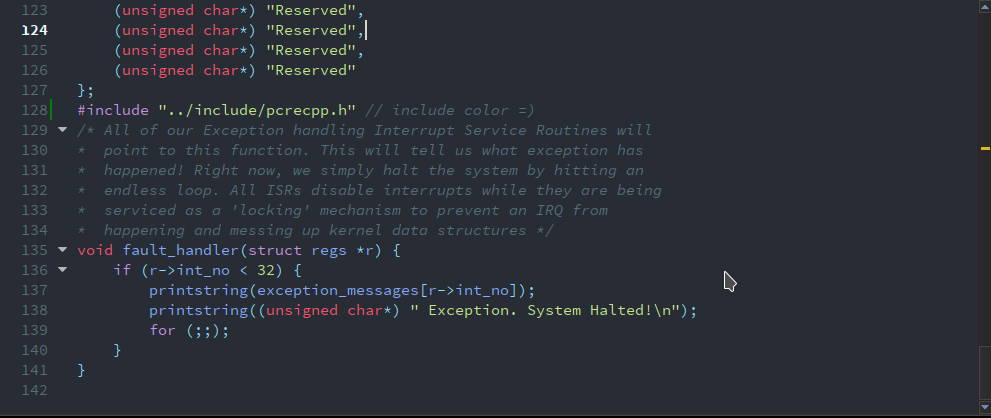
</p>

### SublimeMaterialLight
<p align="center">
  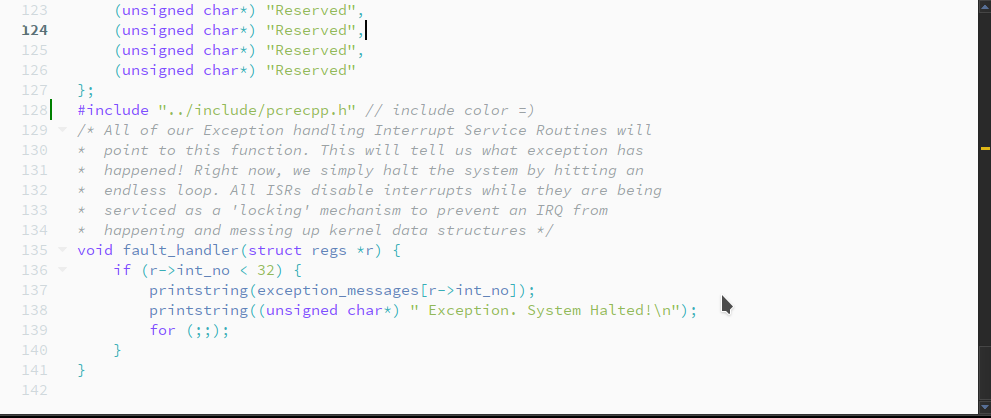
</p>

### VS2012Dark
<p align="center">
  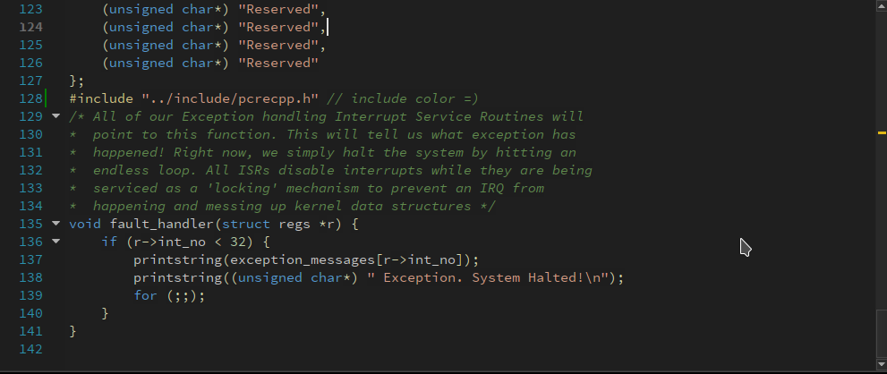
</p>

### VS2013Dark
<p align="center">
  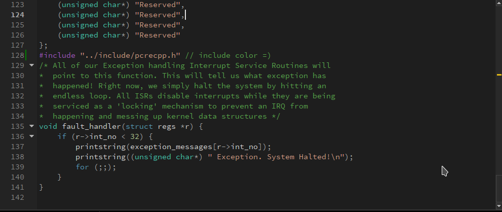
</p>

### VS2015Dark
<p align="center">
  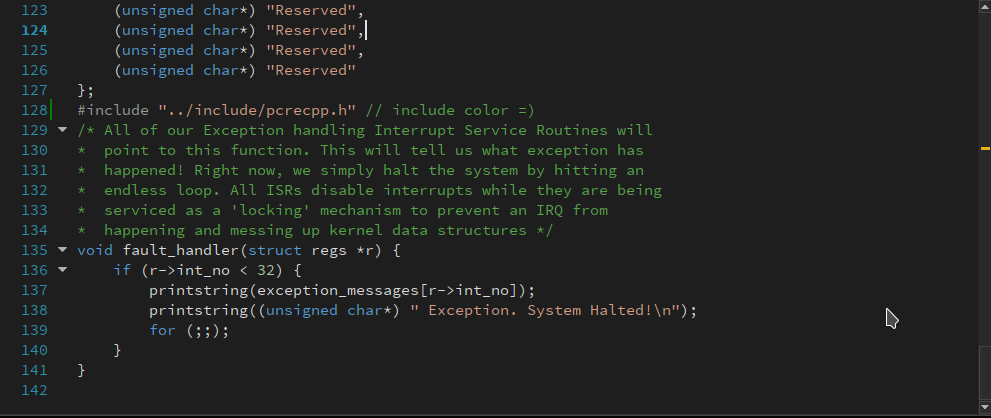
</p>

### Wombat
<p align="center">
  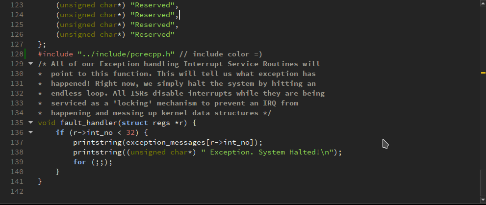
</p>

## Getting Started

These simple instructions will help you easily install color schemes..

### Prerequisites

Check which operating system you have installed, because the installation for each operating system is a bit different.

### Installing

If you have Windows, copy all the xml files to:

```
%APPDATA%\Roaming\QtProject\qtcreator\styles
```

If you have Linux or OSX, copy all the xml files to:

```
~/.config/QtProject/qtcreator/styles
```

This is the whole setup. If you did everything correctly, when you start the QtCreator, you will have color schemes.

## Authors

All these color schemes are found on the Internet. I do not know the authors. If you are an author, let me know and I'll add you to the authors list.

## License

You can freely distribute and modify these color schemes.
